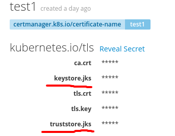
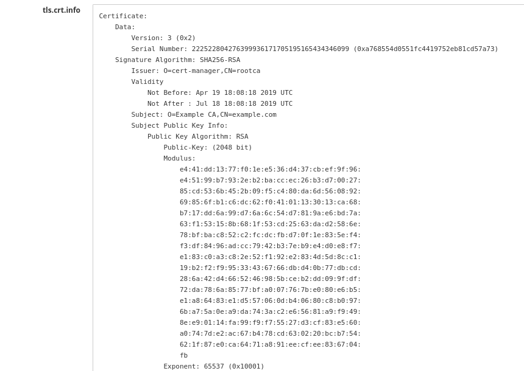
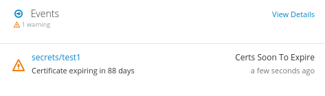
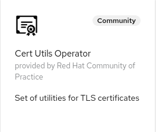

# Cert-utils-operator


[](https://goreportcard.com/report/github.com/redhat-cop/cert-utils-operator)


Cert utils operator is a set of functionalities around certificates packaged in a [Kubernetes operator](https://github.com/operator-framework/operator-sdk).

Certificates are assumed to be available in a [secret](https://kubernetes.io/docs/concepts/configuration/secret/) of type `kubernetes.io/tls` (other types of secrets are *ignored* by this operator).
By convention this type of secrets have three optional entries:

1. `tls.key`: the private key of the certificate.
2. `tls.crt`: the actual certificate.
3. `ca.crt`: the CA bundle that validates the certificate.

The functionalities are the following:

1. [Ability to populate route certificates](#Populating-route-certificates)
2. [Ability to create java keystore and truststore from the certificates](#Creating-java-keystore-and-truststore)
3. [Ability to show info regarding the certificates](#Showing-info-on-the-certificates)
4. [Ability to alert when a certificate is about to expire](#Alerting-when-a-certificate-is-about-to-expire)
5. [Ability to inject ca bundles in Secrets, ConfigMaps, ValidatingWebhookConfiguration, MutatingWebhookConfiguration CustomResourceDefinition and APIService objects](#CA-injection)

All these feature are activated via opt-in annotations.

## Populating route certificates

This feature works on [secure routes](https://docs.openshift.com/container-platform/3.11/architecture/networking/routes.html#secured-routes) with `edge` or `reencrypt` type of termination.

This feature is activated with the following annotation on a route: `cert-utils-operator.redhat-cop.io/certs-from-secret: "<secret-name>"`. Routes that are not secured (`tls.termination` field initialized to either `edge` or `reencrypt`) will be ignored even if they have the annotation.

The following fields of the route will be updated:

1. `key` with the content of `tls.key`.
2. `certificate` with the content of `tls.crt`.
3. `caCertificate` with the content of `ca.crt`.

It is possible to control whether the `caCertificate` field should be injected via the following annotations `cert-utils-operator.redhat-cop.io/inject-CA: "[true|false]"`. The default is `true`. This can be useful if the certificate also contains the ca in ca.crt in its certificate chain. In this case the OpenShift route validation will fail.

The `destinationCACertificate` can also be injected. To activate this feature use the following annotation: `cert-utils-operator.redhat-cop.io/destinationCA-from-secret: "<secret-name>"`. The following field will be updated:

1. `destinationCACertificate` with the content of `ca.crt`.

Note that the two annotations can point to different secrets.

## Creating java keystore and truststore

### Secrets

This feature is activated with the following annotation on a `kubernetes.io/tls` secret: `cert-utils-operator.redhat-cop.io/generate-java-keystores: "true"`.

When this annotation is set two more entries are added to the secret:

1. `keystore.jks`: this Java keystore contains the `tls.crt` and `tls.key` certificate.
2. `trustsstore.jks`: this Java keystore contains the `ca.crt` certificate.

Note that Java Keystore require the key to be in [PKCS#8](https://en.wikipedia.org/wiki/PKCS_8) format. It is a responsibility of the certificate provisioner to make sure the key is in this format. No validation is currently performed by the cert-utils operator.

A such annotated secret looks like the following:



The default password for these keystores is `changeme`. The password can be changed by adding the following optional annotation: `cert-utils-operator.redhat-cop.io/java-keystore-password: <password>`. The alias of the certificate inside the keystore is `alias`.

### ConfigMaps

This feature is activated with the following annotation on a configmap: `cert-utils-operator.redhat-cop.io/generate-java-truststore: "true"`.

When this annotation is the following entry is added to the configmap as binaryData:

1. `truststore.jks`: this Java keystore contains the `ca-bundle.crt` certificate.

Note that Java Keystore require the key to be in [PKCS#8](https://en.wikipedia.org/wiki/PKCS_8) format. It is a responsibility of the certificate provisioner to make sure the key is in this format. No validation is currently performed by the cert-utils operator.

The default password for these keystores is `changeit`. The password can be changed by adding the following optional annotation: `cert-utils-operator.redhat-cop.io/java-keystore-password: <password>`. The alias of the certificate inside the keystore is `alias`.

| Annotation  | Default  | Description  |
|:-|:-:|---|
| `cert-utils-operator.redhat-cop.io/java-keystore-password` | changeit | The password to use when consuming the JKS trust store |
| `cert-utils-operator.redhat-cop.io/generate-java-truststore` | false | Should the JKS file be generated and attached to the configmap |
| `cert-utils-operator.redhat-cop.io/source-ca-key` | ca-bundle.crt | The key in the configmap which will be read to generate the truststore.jks |

## Showing info on the certificates

This feature is activated with the following annotation on a `kubernetes.io/tls` secret: `cert-utils-operator.redhat-cop.io/generate-cert-info: "true"`.

When this annotation is set two more entries are added to the secret:

1. `tls.crt.info`: this entries contains a textual representation of `tls.crt` the certificates in a similar notation to `openssl`.
2. `ca.crt.info`: this entries contains a textual representation of `ca.crt` the certificates in a similar notation to `openssl`.

A such annotated secret looks like the following:



## Alerting when a certificate is about to expire

This feature is activated with the following annotation on a `kubernetes.io/tls` secret: `cert-utils-operator.redhat-cop.io/generate-cert-expiry-alert: "true"`.

When this annotation is set the secret will generate a Kubernetes `Warning` Event if the certificate is about to expire.

This feature is useful when the certificates are not renewed by an automatic system.

The timing of this alerting mechanism can be controller with the following annotations:

| Annotation  | Default  | Description  |
|:-|:-:|---|
| `cert-utils-operator.redhat-cop.io/cert-expiry-check-frequency`  | 7 days  | with which frequency should the system check is a certificate is expiring  |
| `cert-utils-operator.redhat-cop.io/cert-soon-to-expire-check-frequency`  | 1 hour  | with which frequency should the system check is a certificate is expired, once it's close to expiring  |
| `cert-utils-operator.redhat-cop.io/cert-soon-to-expire-threshold`  | 90 days  | what is the interval of time below which we consider the certificate close to expiry  |

Here is an example of a certificate soon-to-expiry event:



## CA Injection

[ValidatingWebhookConfiguration](https://kubernetes.io/docs/reference/access-authn-authz/extensible-admission-controllers/), [MutatingWebhokConfiguration](https://kubernetes.io/docs/reference/access-authn-authz/extensible-admission-controllers/) [CustomResourceDefinition](https://kubernetes.io/docs/concepts/extend-kubernetes/api-extension/custom-resources/) and [APIService](https://kubernetes.io/docs/concepts/extend-kubernetes/api-extension/apiserver-aggregation/) types of objects (and possibly in the future others) need the master API process to connect to trusted servers to perform their function. In order to do so over an encrypted connection, a CA bundle needs to be configured. In these objects the CA bundle is passed as part of the CR and not as a secret, and that is fine because the CA bundles are public info. However it may be difficult at deploy time to know what the correct CA bundle should be. Often the CA bundle needs to be discovered as a piece on information owned by some other objects of the cluster.

This feature allows you to inject the ca bundle from either a `kubernetes.io/tls` secret or from the service_ca.crt file mounted in every pod. The latter is useful if you are protecting your webhook with a certificate generated with the [service service certificate secret](https://docs.openshift.com/container-platform/3.11/dev_guide/secrets.html#service-serving-certificate-secrets) feature.

This feature is activated by the following annotation:

1. `cert-utils-operator.redhat-cop.io/injectca-from-secret: <secret namespace>/<secret name>`

In addition to those objects, it is also possible to inject ca bundles from secrets to secrets and configmaps:

1. `secrets`: the secret must of type: `kubernetes.io/tls`. These types of secret must contain the `tls.crt` and `tls.key` keys, but is this case those keys are going to be presumably empty. So it is recommended to create these secrets as follows:
  
  ```yaml
  apiVersion: v1
  kind: Secret
  metadata:
    annotations:
      cert-utils-operator.redhat-cop.io/injectca-from-secret: test-cert-utils/test1
    name: test-inject-ca
    namespace: test-cert-utils
  type: kubernetes.io/tls
  stringData:
    tls.crt: ""
    tls.key: ""
  ```

2. `confimaps`: the ca bundle will be injected in this key `ca.crt`, here is an example:

  ```yaml
  apiVersion: v1
  kind: ConfigMap
  metadata:
    annotations:
      cert-utils-operator.redhat-cop.io/injectca-from-secret: test-cert-utils/test1
    name: test-inject-ca-cm
    namespace: test-cert-utils
  ```

[Projected volumes](https://kubernetes.io/docs/concepts/storage/volumes/#projected) can be used to merge the caBundle with other pieces of configuration and or change the key name.

## Metrics

Prometheus compatible metrics are exposed by the Operator and can be integrated into OpenShift's default cluster monitoring. To enable OpenShift cluster monitoring, label the namespace the operator is deployed in with the label `openshift.io/cluster-monitoring="true"`.

```shell
oc label namespace <namespace> openshift.io/cluster-monitoring="true"
```

## Deploying the Operator

This is a cluster-level operator that you can deploy in any namespace, `cert-utils-operator` is recommended.

It is recommended to deploy this operator via [`OperatorHub`](https://operatorhub.io/), but you can also deploy it using [`Helm`](https://helm.sh/).

### Deploying from OperatorHub

If you want to utilize the Operator Lifecycle Manager (OLM) to install this operator, you can do so in two ways: from the UI or the CLI.

#### Deploying from OperatorHub UI

* If you would like to launch this operator from the UI, you'll need to navigate to the OperatorHub tab in the console. Before starting, make sure you've created the namespace that you want to install this operator to with the following:

```shell
oc new-project cert-utils-operator
```

* Once there, you can search for this operator by name: `cert utils operator`. This will then return an item for our operator and you can select it to get started. Once you've arrived here, you'll be presented with an option to install, which will begin the process.
* After clicking the install button, you can then select the namespace that you would like to install this to as well as the installation strategy you would like to proceed with (`Automatic` or `Manual`).
* Once you've made your selection, you can select `Subscribe` and the installation will begin. After a few moments you can go ahead and check your namespace and you should see the operator running.



#### Deploying from OperatorHub using CLI

If you'd like to launch this operator from the command line, you can use the manifests contained in this repository by running the following:

oc new-project cert-utils-operator

```shell
oc apply -f config/operatorhub -n cert-utils-operator
```

This will create the appropriate OperatorGroup and Subscription and will trigger OLM to launch the operator in the specified namespace.

### Deploying with Helm

Here are the instructions to install the latest release with Helm.

```shell
oc new-project cert-utils-operator
helm repo add cert-utils-operator https://redhat-cop.github.io/cert-utils-operator
helm repo update
helm install cert-utils-operator cert-utils-operator/cert-utils-operator
```

This can later be updated with the following commands:

```shell
helm repo update
helm upgrade cert-utils-operator cert-utils-operator/cert-utils-operator
```

## Development

## Running the operator locally

```shell
make manifests
oc new-project cert-utils-operator-local
kustomize build ./config/local-development | oc apply -f - -n cert-utils-operator-local
export token=$(oc serviceaccounts get-token 'cert-utils-controller-manager' -n cert-utils-operator-local)
oc login --token ${token}
make run ENABLE_WEBHOOKS=false
```

### Test helm chart locally

Define an image and tag. For example...

```shell
export imageRepository="quay.io/redhat-cop/cert-utils-operator"
export imageTag=$(git describe --tags --abbrev=0)" # grabs the most recent git tag, which should match the image tag
```

Deploy chart...

```shell
make helmchart IMG=${imageRepository} VERSION=${imageTag}
helm upgrade -i cert-utils-operator-local charts/cert-utils-operator -n cert-utils-operator-local --create-namespace
```

Delete...

```shell
helm delete cert-utils-operator-local -n cert-utils-operator-local
kubectl delete -f charts/cert-utils-operator/crds/crds.yaml
```

## Building/Pushing the operator image

```shell
export repo=raffaelespazzoli #replace with yours
docker login quay.io/$repo
make docker-build IMG=quay.io/$repo/cert-utils-operator:latest
make docker-push IMG=quay.io/$repo/cert-utils-operator:latest
```

## Deploy to OLM via bundle

```shell
make manifests
make bundle IMG=quay.io/$repo/cert-utils-operator:latest
operator-sdk bundle validate ./bundle --select-optional name=operatorhub
make bundle-build BUNDLE_IMG=quay.io/$repo/cert-utils-operator-bundle:latest
docker push quay.io/$repo/cert-utils-operator-bundle:latest
operator-sdk bundle validate quay.io/$repo/cert-utils-operator-bundle:latest --select-optional name=operatorhub
oc new-project cert-utils-operator
oc label namespace cert-utils-operator openshift.io/cluster-monitoring="true"
operator-sdk cleanup cert-utils-operator -n cert-utils-operator
operator-sdk run bundle --install-mode AllNamespaces -n cert-utils-operator quay.io/$repo/cert-utils-operator-bundle:latest
```

## Tesing

### Testing metrics

```sh
export operatorNamespace=cert-utils-operator-local # or cert-utils-operator
oc label namespace ${operatorNamespace} openshift.io/cluster-monitoring="true"
oc rsh -n openshift-monitoring -c prometheus prometheus-k8s-0 /bin/bash
curl -v -s -k -H "Authorization: Bearer $(cat /var/run/secrets/kubernetes.io/serviceaccount/token)" https://resource-locker-operator-controller-manager-metrics.${operatorNamespace}.svc.cluster.local:8443/metrics
```

## Releasing

```shell
git tag -a "<tagname>" -m "<commit message>"
git push upstream <tagname>
```

If you need to remove a release:

```shell
git tag -d <tagname>
git push upstream --delete <tagname>
```

If you need to "move" a release to the current main

```shell
git tag -f <tagname>
git push upstream -f <tagname>
```

### Cleaning up

```shell
operator-sdk cleanup cert-utils-operator -n cert-utils-operator
oc delete operatorgroup operator-sdk-og
oc delete catalogsource cert-utils-operator-catalog
```
